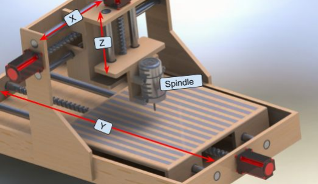
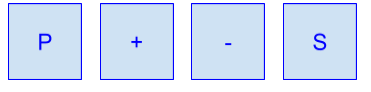
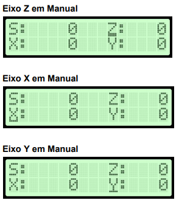
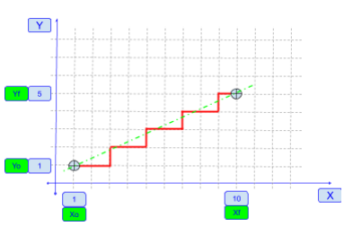
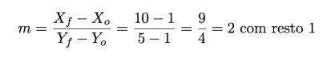
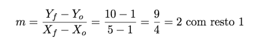
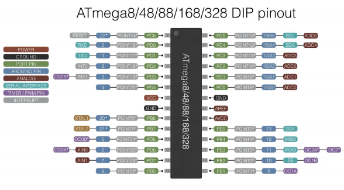
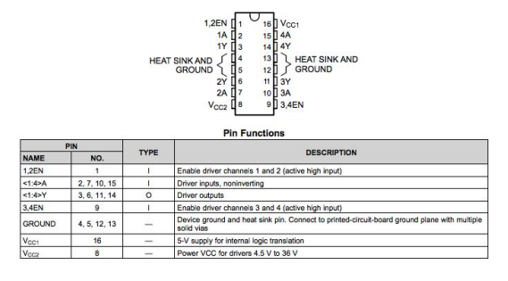
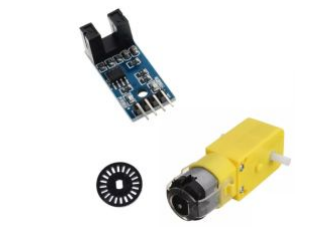

# Router CNC

Projeto final da disciplina Automação I.

* __Objetivo__
  
  Projetar um sistema de controle para um Router CNC com interface de comandos
pela porta serial e interface homem máquina simples com display de LCD e botões. Projetar
o placa de controle para os servomotores e spindle.

* __Background__
  
  Um Router CNC é basicamente uma fresadora controlada eletronicamente por um
sistema microprocessado e acionada por servomotores. A estrutura mecânica básica
consiste em 3 eixos ortogonais, X, Y e Z, e um eixo rotativo, normalmente denominado eixo
árvore ou spindle, Figura 1.

   

* __Projeto__

  O diagrama de blocos do sistema é apresentado na figura 2.

   

* __Interface Homem-Máquina__
  
  O bloco de interface deve conter um display de LCD 16x2 e 4 botões. A interface
deverá apresentar a posição atual dos eixos, velocidade do spindle bem como possibilitar a
modificação do estado da máquina, referência, manual ou automático.
  
  *Teclado*
                 
                P: Ativar/Desativar e Selecionar eixo para movimento manual.
                +: Movimenta eixo no sentido positivo, horário (CW).
                -: Movimenta eixo no sentido negativo, anti-horário (CCW)
                S: Liga spindle em manual.

  

    

  

  *Telas*
  
  Ao energizar o sistema:
      
  Retornar ao ponto de referência quando pressionado tecla S. Para que seja possível
  executar a referência a entrada Cover Closed deve estar em nível lógico alto, chave
  fechada.      
                      
  

    

  

              Caso a entrada Cover Closed esteja em nível baixo (chave aberta), e a tecla S for
          pressionada, o display deverá informar o erro durante 3 segundos e retornar à tela inicial.
          
  

    

  

              Após satisfeita a condição da entrada Cover Closed, quando pressionada a tecla S,
          o sistema entra no modo de referência, nesse modo os motores dos eixo X, Y e Z se
          movem (em velocidade baixa) no sentido horário até atingirem o sensores de referência,
          Home X, Home Y e Home Z. Durante este processo deverá ser mostrado a tela de
          referenciamento. Se em qualquer momento a entrada Cover Closed for desacionada, a tela
          de erro deverá ser mostrada por 3 segundos e retornar à tela inicial para reiniciar o
          processo.

  

    

  
          
             Quando o processo de referenciamento estiver concluído, sensores Home X, Home
          Y e Home Z em ativados (ativados = nível alto), deverá ser mostrada a tela posição.
          
  

    

  
       
  
  No processo de referência as variáveis de contagem de posição deve ser zeradas e
  a variável eixos referenciados setada para um.
  A partir da tela de posição deve ser possível mover os eixo de forma manual (X, Y e
  Z), para tanto deverá ser pressionado a tecla P a fim de selecionar um dos eixos. O eixo
  selecionado deve ser destacado com o caractere de sublinhado, indicando o movimento
  manual habilitado. Para sair do modo manual deve-se percorrer os eixos Z, X e Y,
  pressionando a tecla P, se a seleção atual for do eixo Y e a tecla P for pressionada
  novamente, o modo manual é desabilitado e a tela de posição é mostrada novamente.

  

    

  
 
  
  Em modo manual o eixo selecionado é movido através da teclas + e - . Quando
  pressionado a tecla + o eixo se move no sentido horário (CW), quando pressionada tecla -
  em sentido anti-horário (CCW).
      O movimento deve respeitar os limites físicos do curso mecânico de cada eixo,
  exposto abaixo:
          
  Curso de deslocamento dos Eixos:
     
      ● Eixo X: 0… 200mm
      ● Eixo Y: 0… 300mm
      ● Eixo Z: 0… 150mm

  Caso o eixo que está sendo movimentado atingir o final do curso, uma mensagem
  de erro deverá ser informada, indicando o eixo e o sentido em que ocorreu o final do curso,
  exemplo abaixo.

  

    

  
 

  Durante o modo manual, o eixo spindle é ligado através da tecla S. Pressionando a
  tecla S uma vez o eixo Spindle liga em velocidade fixa de 500 RPM, Pressionando
  novamente S, o eixo Spindle desliga.
  Se o Spindle for ligado manualmente e o modo manual for desativado, o eixo é
  desligado automaticamente.

  

    

  
 

**_Nenhum movimento deve ser permitido quando a entrada Cover
Closed estiver em nível lógico baixo. Se um comando de movimento
ocorrer, a tela de erro deverá ser mostrada._**

* __Interface Serial__
  
    Se o modo manual não estiver ativado, o controlador aceita comandos pela entrada
  serial, os comandos permitidos são listados abaixo:

  

    

  
 

  As mensagens recebidas devem ser estar entre os caracteres delimitadores de início
  ($) e final (#) de mensagem. Exemplos de mensagem válida:

  ● Ex1.: Ajustar a velocidade do spindle para 1000 RPM, ativar o giro no sentido CW,
  ajustar a velocidade de movimento dos eixo em rápido e mover o eixo Z para a
  posição 10.

          $S=1000M3Z=10F=Rapido#
  
  ● Ex2.: Mover eixo X para a posição 10 e o eixo Y para a posição 5. Neste caso os
  eixo movem com a última velocidade ajustada (Lento, Medio, Rapido ).
          
          $X=10Y=5#

  Exemplo de interpolação para o comando acima supondo a posição anterior de X e
  Y em 1:

  

    

  

  Para o cálculo da interpolação levar em consideração o incremento mínimo do sistema,
  para este o projeto, o menor incremento possível é uma unidade (10 passos no motor de
  passos equivalem a uma unidade ou 1mm). Realizar o cálculo do fator de interpolação m
  utilizando a divisão de inteiros, veja abaixo:

  

    

  
 
 

    Assim, para cada dois incrementos em X ocorre um incremento em Y, ao final da
  interpolação, como visto na figura acima, o eixo x deve andar mais uma unidade, resto da
  divisão, para atingir a posição final.
    Como será utilizado a divisão de inteiros, o numerador deve ser sempre o maior
  valor, supondo que no exemplo acima o deslocamento comandado fosse de X=5 e Y=10 a
  interpolação seria:

  

    

  
 

    Assim, para cada dois incrementos em Y ocorre um incremento em X, ao final da
  interpolação o eixo Y é que deve andar mais uma unidade, resto da divisão, para atingir a
  posição final.

* __MCU__
  
  O microcontrolador é o ATMEGA328P (Arduino).
  

  

 

* __Driver__
  
  O driver utilizado é circuito integrado L293D - Quadruple Half-H Drivers, pinagem
mostrada abaixo:

  

 

* __Motor dos eixos__
  
  Serão utilizados motores de passo unipolares, esquema de ligação conforme abaixo.
  

  

 

* __Spindle__
  
  O motor do Spindle será simulado com um Motor DC e um encoder de 20PPR. A
velocidade atual, não a programada, deverá ser mostrada no display da interface.

  

 

* __Heart Beat__
  
  Um LED deverá ser utilizado para informar que o sistema está em execução. O LED
deverá permanecer aceso caso o driver de saída esteja desabilitado.

* __Chaves e sensores__
  
  Devem ser utilizados chaves normalmente abertas para simular o comportamento
dos sensores de referência (Home) e de proteção aberta (Cover Closed).

* __Softwares utilizados__

  ● Sloeber, IDE do Eclipse para o Arduino
  ● Proteus 8 Professional
  
* __Diagrama esquemático__

  

 

* __Montagem prática__

  

 

* __Modelo em 3D da Placa de circuito impresso__

  

 
